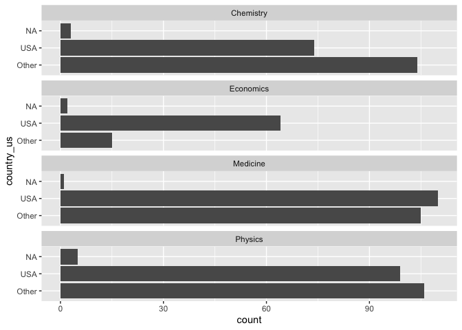

Lab 03 - Nobel laureates
================
Lindsay Stall
01/20/2023

### Load packages and data

``` r
library(tidyverse) 
```

``` r
nobel <- read_csv("data/nobel.csv")
```

## Exercises

### Exercise 1

``` rview
view(nobel)
```

There are 935 observations, and 26 variables. Each row represents
information of a different nobel prize winning scientist.

### Exercise 2

``` r
nobel_living <- nobel

nobel_living %>% 

  filter(country != "NA") %>%

  filter(gender != "org") %>%

  filter(is.na(died_date))
```

    ## # A tibble: 228 × 26
    ##       id firstname   surname    year category affilia…¹ city  country born_date 
    ##    <dbl> <chr>       <chr>     <dbl> <chr>    <chr>     <chr> <chr>   <date>    
    ##  1    68 Chen Ning   Yang       1957 Physics  Institut… Prin… USA     1922-09-22
    ##  2    69 Tsung-Dao   Lee        1957 Physics  Columbia… New … USA     1926-11-24
    ##  3    95 Leon N.     Cooper     1972 Physics  Brown Un… Prov… USA     1930-02-28
    ##  4    97 Leo         Esaki      1973 Physics  IBM Thom… York… USA     1925-03-12
    ##  5    98 Ivar        Giaever    1973 Physics  General … Sche… USA     1929-04-05
    ##  6    99 Brian D.    Josephson  1973 Physics  Universi… Camb… United… 1940-01-04
    ##  7   101 Antony      Hewish     1974 Physics  Universi… Camb… United… 1924-05-11
    ##  8   103 Ben R.      Mottelson  1975 Physics  Nordita   Cope… Denmark 1926-07-09
    ##  9   106 Samuel C.C. Ting       1976 Physics  Massachu… Camb… USA     1936-01-27
    ## 10   107 Philip W.   Anderson   1977 Physics  Bell Tel… Murr… USA     1923-12-13
    ## # … with 218 more rows, 17 more variables: died_date <date>, gender <chr>,
    ## #   born_city <chr>, born_country <chr>, born_country_code <chr>,
    ## #   died_city <chr>, died_country <chr>, died_country_code <chr>,
    ## #   overall_motivation <chr>, share <dbl>, motivation <chr>,
    ## #   born_country_original <chr>, born_city_original <chr>,
    ## #   died_country_original <chr>, died_city_original <chr>, city_original <chr>,
    ## #   country_original <chr>, and abbreviated variable name ¹​affiliation

### Exercise 3

``` r
nobel_living <- nobel_living %>%
  mutate(
    country_us = if_else(country == "USA", "USA", "Other")
  )
```

``` r
nobel_living_science <- nobel_living %>%
  filter(category %in% c("Physics", "Medicine", "Chemistry", "Economics"))
```

``` r
ggplot(nobel_living_science, aes(y = country_us))+
geom_bar()+
facet_wrap(~category, ncol = 1)
```

<!-- -->

### Exercise 4

…

### Exercise 5

…

### Exercise 6

…
