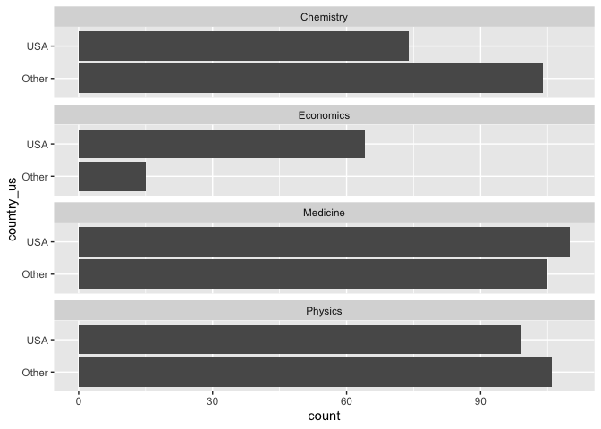
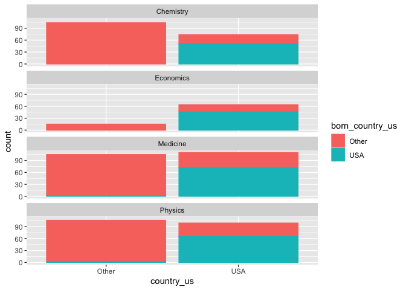

Lab 03 - Nobel laureates
================
Lindsay Stall
01/20/2023

### Load packages and data

``` r
library(tidyverse) 
```

``` r
nobel <- read_csv("data/nobel.csv")
```

## Exercises

### Exercise 1

``` r
summary(nobel)
```

    ##        id         firstname           surname               year     
    ##  Min.   :  1.0   Length:935         Length:935         Min.   :1901  
    ##  1st Qu.:234.5   Class :character   Class :character   1st Qu.:1947  
    ##  Median :470.0   Mode  :character   Mode  :character   Median :1976  
    ##  Mean   :475.1                                         Mean   :1970  
    ##  3rd Qu.:716.5                                         3rd Qu.:1999  
    ##  Max.   :969.0                                         Max.   :2018  
    ##                                                                      
    ##    category         affiliation            city             country         
    ##  Length:935         Length:935         Length:935         Length:935        
    ##  Class :character   Class :character   Class :character   Class :character  
    ##  Mode  :character   Mode  :character   Mode  :character   Mode  :character  
    ##                                                                             
    ##                                                                             
    ##                                                                             
    ##                                                                             
    ##    born_date            died_date             gender         
    ##  Min.   :1817-11-30   Min.   :1903-11-01   Length:935        
    ##  1st Qu.:1890-12-25   1st Qu.:1955-08-02   Class :character  
    ##  Median :1916-06-28   Median :1983-03-09   Mode  :character  
    ##  Mean   :1910-11-02   Mean   :1977-03-30                     
    ##  3rd Qu.:1935-07-10   3rd Qu.:2004-07-24                     
    ##  Max.   :1997-07-12   Max.   :2019-08-07                     
    ##  NA's   :33           NA's   :308                            
    ##   born_city         born_country       born_country_code   died_city        
    ##  Length:935         Length:935         Length:935         Length:935        
    ##  Class :character   Class :character   Class :character   Class :character  
    ##  Mode  :character   Mode  :character   Mode  :character   Mode  :character  
    ##                                                                             
    ##                                                                             
    ##                                                                             
    ##                                                                             
    ##  died_country       died_country_code  overall_motivation     share      
    ##  Length:935         Length:935         Length:935         Min.   :1.000  
    ##  Class :character   Class :character   Class :character   1st Qu.:1.000  
    ##  Mode  :character   Mode  :character   Mode  :character   Median :2.000  
    ##                                                           Mean   :1.991  
    ##                                                           3rd Qu.:3.000  
    ##                                                           Max.   :4.000  
    ##                                                                          
    ##   motivation        born_country_original born_city_original
    ##  Length:935         Length:935            Length:935        
    ##  Class :character   Class :character      Class :character  
    ##  Mode  :character   Mode  :character      Mode  :character  
    ##                                                             
    ##                                                             
    ##                                                             
    ##                                                             
    ##  died_country_original died_city_original city_original      country_original  
    ##  Length:935            Length:935         Length:935         Length:935        
    ##  Class :character      Class :character   Class :character   Class :character  
    ##  Mode  :character      Mode  :character   Mode  :character   Mode  :character  
    ##                                                                                
    ##                                                                                
    ##                                                                                
    ## 

There are 935 observations, and 26 variables. Each row represents
information of a different nobel prize winning scientist.

### Exercise 2

``` r
nobel_living <- nobel

nobel_living %>% 

  filter(country != "NA") %>%

  filter(gender != "org") %>%

  filter(is.na(died_date))
```

    ## # A tibble: 228 × 26
    ##       id firstname   surname    year category affilia…¹ city  country born_date 
    ##    <dbl> <chr>       <chr>     <dbl> <chr>    <chr>     <chr> <chr>   <date>    
    ##  1    68 Chen Ning   Yang       1957 Physics  Institut… Prin… USA     1922-09-22
    ##  2    69 Tsung-Dao   Lee        1957 Physics  Columbia… New … USA     1926-11-24
    ##  3    95 Leon N.     Cooper     1972 Physics  Brown Un… Prov… USA     1930-02-28
    ##  4    97 Leo         Esaki      1973 Physics  IBM Thom… York… USA     1925-03-12
    ##  5    98 Ivar        Giaever    1973 Physics  General … Sche… USA     1929-04-05
    ##  6    99 Brian D.    Josephson  1973 Physics  Universi… Camb… United… 1940-01-04
    ##  7   101 Antony      Hewish     1974 Physics  Universi… Camb… United… 1924-05-11
    ##  8   103 Ben R.      Mottelson  1975 Physics  Nordita   Cope… Denmark 1926-07-09
    ##  9   106 Samuel C.C. Ting       1976 Physics  Massachu… Camb… USA     1936-01-27
    ## 10   107 Philip W.   Anderson   1977 Physics  Bell Tel… Murr… USA     1923-12-13
    ## # … with 218 more rows, 17 more variables: died_date <date>, gender <chr>,
    ## #   born_city <chr>, born_country <chr>, born_country_code <chr>,
    ## #   died_city <chr>, died_country <chr>, died_country_code <chr>,
    ## #   overall_motivation <chr>, share <dbl>, motivation <chr>,
    ## #   born_country_original <chr>, born_city_original <chr>,
    ## #   died_country_original <chr>, died_city_original <chr>, city_original <chr>,
    ## #   country_original <chr>, and abbreviated variable name ¹​affiliation

### Exercise 3

``` r
nobel_living <- nobel_living %>%
  mutate(
    country_us = if_else(country == "USA", "USA", "Other")
  )
```

``` r
nobel_living_science <- nobel_living %>%
  filter(category %in% c("Physics", "Medicine", "Chemistry", "Economics"))%>%
  filter(country_us != "NA")
```

``` r
ggplot(nobel_living_science, aes(y = country_us))+
geom_bar()+
facet_wrap(~category, ncol = 1)
```

<!-- --> While the US
has many more nobel prize winning scientists than other countries in the
field of economics, it has fewer in the field of Chemistry and
comparable amounts in Medicine and Physics.

### Exercise 4

``` r
nobel_living <- nobel_living %>%
  mutate(born_country_us = if_else(born_country == "USA", "USA", "Other"))
```

``` r
nobel_living %>%
  select(born_country_us)
```

    ## # A tibble: 935 × 1
    ##    born_country_us
    ##    <chr>          
    ##  1 Other          
    ##  2 Other          
    ##  3 Other          
    ##  4 Other          
    ##  5 Other          
    ##  6 Other          
    ##  7 Other          
    ##  8 Other          
    ##  9 Other          
    ## 10 Other          
    ## # … with 925 more rows

``` r
summary(as.factor(nobel_living$born_country_us))
```

    ## Other   USA  NA's 
    ##   636   271    28

271 were born in the US.

### Exercise 5

``` r
nobel_living_science <- nobel_living %>%
  mutate(born_country_us = if_else(born_country == "USA", "USA", "Other"))
```

``` r
nobel_living_science <- nobel_living %>% 
  filter(category %in% c("Physics", "Medicine", "Chemistry", "Economics"))%>%
  filter(country_us != "NA")
```

``` r
ggplot(nobel_living_science, aes(x = country_us, color = born_country_us, fill= born_country_us))+
geom_bar()+
facet_wrap(~category, ncol = 1)
```

<!-- -->

Buzzfeed said that most living laureates were based in the US when they
were born. The above graph shows that that is only true for economics.
While there are a lot of people born outside of the US who got the
award, of the ones who received it in US, most were born in the US.

### Exercise 6

``` r
nobel_living_science %>%
  filter(country_us == "USA") %>%
  filter(born_country_us == "Other") %>%
  count(born_country) %>%
  arrange(desc(n))
```

    ## # A tibble: 37 × 2
    ##    born_country       n
    ##    <chr>          <int>
    ##  1 United Kingdom    15
    ##  2 Canada            12
    ##  3 Germany           10
    ##  4 China              6
    ##  5 Poland             6
    ##  6 France             5
    ##  7 Italy              5
    ##  8 Japan              5
    ##  9 Austria            4
    ## 10 Hungary            4
    ## # … with 27 more rows

Most of the winners from the US were born in the UK.
